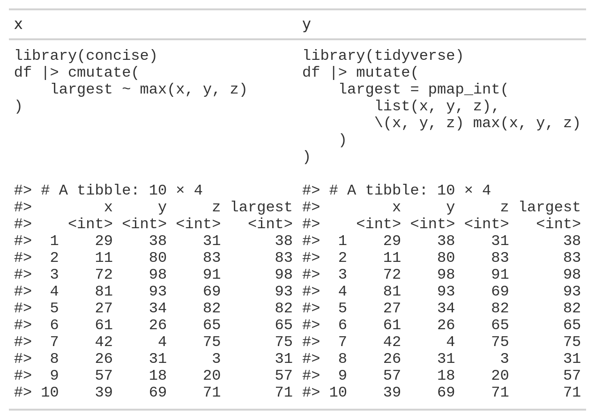

<!-- README.md is generated from README.Rmd. Please edit that file -->

```{r, include = FALSE}
knitr::opts_chunk$set(
  collapse = TRUE,
  comment = "#>",
  out.width = "100%"
)
```

# concise

<!-- badges: start -->
<!-- badges: end -->

## Overview
`concise` functions are designed to make clean, intelligible lambda functions
to keep your code concise and easily readable. They are modelled on common `tidyverse`
functions like `purrr::map` and `dplyr::mutate`, but with a layer of syntactic
sugar to make anonymous functions that can condense a paragraph's worth of code 
into a single line.

* Refer to data columns directly -- avoid placeholder pronouns like `.x` or `..1`
and instead refer to your data by name.
* Leverages `purrr`'s mapping functions to outperform slow `dplyr::rowwise` operations
and facilitate non-rowwise column mutations in the same call.
* Helpful shorthand gives access to column properties like row number, the size 
of grouped data (i.e. cardinality) and the names attribute inside the iterative
function.
* Interact with and preserve groups created by `dplyr::group_by`.
* Access the entire data column as well as individual elements to write custom
summary and window functions such as moving averages.
* Refer to anonymous functions inside their own definitions to write recursive
functions.

## Installation

You can install the development version of concise from [GitHub](https://github.com/) with:

``` r
# install.packages("devtools")
devtools::install_github("domjarkey/concise")
```

## Usage

### `cmutate`

`cmutate` performs the same role as `dplyr::mutate` but with the option of evaluating
column definitions as iterative lambda functions.

This allows for the easy application of non-vectorised functions on a row-by-row
basis.

```{r cmutate, message=FALSE}
library(concise)

tibble(value = list('a', 'b', NULL, 'd', NULL)) |>
    cmutate(value_exists ~ is.null(value))
```

As with `dplyr::mutate`, ordinary column mutations can also be called with `=`,
and multiple mutations can be called at once, able to make reference to columns
created or modified within the same function call:

```{r cmutate2, message=FALSE}
tidyr::expand_grid(
    word = c('banana', 'canal barge'),
    expression = c('.an', 'ba.')
) |> cmutate(
    substring ~ stringr::str_extract(word, expression),
    first_three = stringr::str_extract(word, "^\\w{3}"),
    concat = paste(first_three, substring)
)
```

#### Examples

##### Find the largest element of multiple columns:

`concise` handles expressions marked with a `~` using its own simplified syntax,
but effectively it passes any columns called to `purrr`'s `pmap` function. This
makes it computationally faster and more versatile than the equivalent operation
using `dplyr::rowwise` while making your source code easier to write and clearer
to read.

```{r}
numbers <- tibble(
    x = c(29L, 11L, 72L, 81L, 27L, 61L, 42L, 26L, 57L, 39L),
    y = c(38L, 80L, 98L, 93L, 34L, 26L, 4L, 31L, 18L, 69L),
    z = c(31L, 83L, 91L, 69L, 82L, 65L, 75L, 3L, 20L, 71L)
)
```

::: {align="center"}
{#id .class width=664px height=448px}
:::

##### Calculate a moving average of the three latest entries:

`concise` allows the use of special pronouns to refer to things like the row index
(`.i`), the final row index of the data (`.n`), or the entire column as a vector
(`<column_name>.col`). These can be used to make simple, intelligible window functions.

```{r}
numbers |> cmutate(
    avg_x ~ mean(x.col[max(.i - 3, 1):.i])
)
```

##### Use pronouns in combination with data groupings

When data is grouped, the `<column_name>.grp` pronoun refers to all elements of the
data in the same group as a vector, while `<column_name>.col` will refer to the
entire, ungrouped column. Similarly, `.i` will refer to the index of the elemenent
in the group, while `.I` will refer to the absolute index.

```{r}
numbers$letter <- rep(c('A', 'B'), each = 5)

numbers |>
    select(letter, x) |>
    group_by(letter) |>
    cmutate(
        prop_of_group ~ x / sum(x.grp),
        prop_of_whole ~ x / sum(x.col),
        group_row_index ~ .i,
        column_row_index ~ .I
    )
```

N.B. Similarly to `.i`/`.I`, when grouped, `.n` refers to the row index of the 
final entry in the group (or equally, the cardinality of the group), and `.N` to
the number of rows in the ungrouped data.

##### Specifying data type with `?`

Under the surface, `cmutate` calls `purrr:pmap` but simplifies the output to the
most suitable data type. On occasion, it may be useful to specify the data
type of the output column, similar to calling `pmap_int` or `pmap_chr`. This can
be done using the `?` operator as in the following example:

```{r}
numbers |>
    select(x, y, z) |>
    cmutate(
        max ~ max(x, y, z),
        max_int ~ max(x, y, z) ? int,
        max_dbl ~ max(x, y, z) ? dbl,
        max_chr ~ max(x, y, z) ? chr,
        max_list ~ max(x, y, z) ? list,
    )
```

N.B. As with `purrr`'s mapping functions, `?` won't automatically coerce any data
type, so it is recommended to use functions such as `as.integer` or `as.character`
where appropriate.

### `rmap` and `cmap`

`rmap` applies an anonymous function to a data frame while allowing the columns
to be referred to directly inside the function definition. As with `cmutate` and
other `concise` functions, pronouns such as `.i` (the index or position in the
element in the list) are able to be used.

`rmap` works similarly to `purrr::pmap` except the input data frame does not need
to be subset to only those columns used in the function. The data type of the
output is specified in a similar fashion to other `purrr` map functions, e.g.
`rmap_chr`, `rmap_dbl`, `rmap_df`, etc.

```{r}
numbers |>
    rmap_chr(~ paste0(letter, .i, ": ", mean(c(x, y, z))))
```

`cmap` works similarly to `purrr::map`, taking a single input vector or list,
except it also allows for use of `concise` pronouns. In the below example, `.nm`
is used to refer to the `names` attribute for each element in the input vector, 
and `.col` refers to the entire input vector.

```{r}
state_areas <- state.area
names(state_areas) <- state.name

state_areas |>
    cmap_df(
        ~ c(
            state = .nm,
            larger_than_median_state = .x > median(.col)
        )
    )
```

### Recursion in `concise`

Occasionally it can be useful to define a function recursively, performing the
same computation on an output until a base case is reached. This is usually not
ideal if avoidable, but in certain circumstances such as list traversal or web
scraping, it can be handy to call a function inside itself to complete a task 
with an indefinite amount of steps. In `concise` functions, this can be accomplished
using the `.this` pronoun. A simple example is given here but further elaboration
will be given in an upcoming vignette.

The canonical example of recursion is Fibonacci's sequence, where the first two
terms are defined as 1 and 1 (or sometimes 0 and 1), and the nth term is defined
as the sum of the two previous terms. This sequence can be succinctly computed using
`cmap`:

```{r}
cmap_int(1:10, ~ if (.x <= 2) {1} else {.this(.x - 1) + .this(.x - 2)})
```
