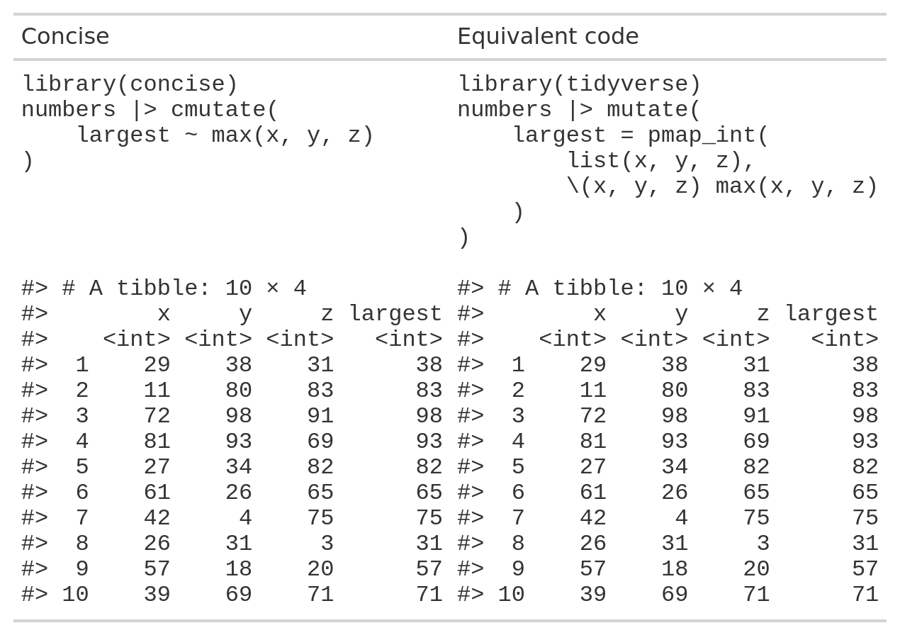

<!-- README.md is generated from README.Rmd. Please edit that file -->

# concise

<!-- badges: start -->
<!-- badges: end -->

## Overview

`concise` functions are designed to make clean, intelligible lambda
functions to keep your code concise and easily readable. They are
modelled on common `tidyverse` functions like `purrr::map` and
`dplyr::mutate`, but with a layer of syntactic sugar to make anonymous
functions that can condense a paragraph’s worth of code into a single
line.

- Refer to data columns directly – avoid placeholder pronouns like `.x`
  or `..1` and instead refer to your data by name.
- Leverages `purrr`’s mapping functions to outperform slow
  `dplyr::rowwise` operations and facilitate non-rowwise column
  mutations in the same call.
- Helpful shorthand gives access to column properties like row number,
  the size of grouped data (i.e. cardinality) and the names attribute
  inside the iterative function.
- Interact with and preserve groups created by `dplyr::group_by`.
- Access the entire data column as well as individual elements to write
  custom summary and window functions such as moving averages.
- Refer to anonymous functions inside their own definitions to write
  recursive functions.

## Installation

You can install the development version of concise from
[GitHub](https://github.com/) with:

``` r
# install.packages("devtools")
devtools::install_github("domjarkey/concise")
```

## Usage

### `cmutate`

`cmutate` performs the same role as `dplyr::mutate` but with the option
of evaluating column definitions as iterative lambda functions.

This allows for the easy application of non-vectorised functions on a
row-by-row basis.

``` r
library(concise)

tibble(fruit = list('apple', 'banana', NULL, 'dragonfruit', NULL)) |>
    cmutate(fruit_exists ~ !is.null(fruit))
#> # A tibble: 5 × 2
#>   fruit     fruit_exists
#>   <list>    <lgl>       
#> 1 <chr [1]> TRUE        
#> 2 <chr [1]> TRUE        
#> 3 <NULL>    FALSE       
#> 4 <chr [1]> TRUE        
#> 5 <NULL>    FALSE
```

As with `dplyr::mutate`, ordinary column mutations can also be called
with `=`, and multiple mutations can be performed at once, able to make
reference to columns created or modified within the same function call:

``` r
tibble(fruit = list('apple', 'banana', NULL, 'dragonfruit', NULL)) |>
    cmutate(
        fruit_exists ~ !is.null(fruit),
        fruit_name_length ~ ifelse(fruit_exists, stringr::str_length(fruit), 0),
        fruit = as.character(ifelse(fruit_exists, fruit, "NO FRUIT FOUND"))
    )
#> # A tibble: 5 × 3
#>   fruit          fruit_exists fruit_name_length
#>   <chr>          <lgl>                    <dbl>
#> 1 apple          TRUE                         5
#> 2 banana         TRUE                         6
#> 3 NO FRUIT FOUND FALSE                        0
#> 4 dragonfruit    TRUE                        11
#> 5 NO FRUIT FOUND FALSE                        0
```

#### Examples

##### Find the largest element of multiple columns:

`concise` handles expressions marked with a `~` using its own simplified
syntax, but effectively it passes any columns called to `purrr`’s `pmap`
function. This makes it computationally faster and more versatile than
the equivalent operation using `dplyr::rowwise` while making your source
code easier to write and clearer to read.

``` r
numbers <- tibble(
    x = c(29L, 11L, 72L, 81L, 27L, 61L, 42L, 26L, 57L, 39L),
    y = c(38L, 80L, 98L, 93L, 34L, 26L, 4L, 31L, 18L, 69L),
    z = c(31L, 83L, 91L, 69L, 82L, 65L, 75L, 3L, 20L, 71L)
)
```

<div align="center">



</div>

##### Calculate a moving average of the three latest entries:

`concise` allows the use of special pronouns to refer to things like the
row index (`.i`), the final row index of the data (`.n`), or the entire
column as a vector (`<column_name>.col`). These can be used to make
simple, intelligible window functions.

``` r
numbers |> cmutate(
    avg_x ~ mean(x.col[max(.i - 3, 1):.i])
)
#> # A tibble: 10 × 4
#>        x     y     z avg_x
#>    <int> <int> <int> <dbl>
#>  1    29    38    31  29  
#>  2    11    80    83  20  
#>  3    72    98    91  37.3
#>  4    81    93    69  48.2
#>  5    27    34    82  47.8
#>  6    61    26    65  60.2
#>  7    42     4    75  52.8
#>  8    26    31     3  39  
#>  9    57    18    20  46.5
#> 10    39    69    71  41
```

##### Use pronouns in combination with data groupings

When data is grouped, the `<column_name>.grp` pronoun refers to all
elements of the data in the same group as a vector, while
`<column_name>.col` will refer to the entire, ungrouped column.
Similarly, `.i` will refer to the index of the elemenent in the group,
while `.I` will refer to the absolute index.

``` r
numbers$letter <- rep(c('A', 'B'), each = 5)

numbers |>
    select(letter, x) |>
    group_by(letter) |>
    cmutate(
        prop_of_group ~ x / sum(x.grp),
        prop_of_whole ~ x / sum(x.col),
        group_row_index ~ .i,
        column_row_index ~ .I
    )
#> # A tibble: 10 × 6
#> # Groups:   letter [2]
#>    letter     x prop_of_group prop_of_whole group_row_index column_row_index
#>    <chr>  <int>         <dbl>         <dbl>           <int>            <int>
#>  1 A         29         0.132        0.0652               1                1
#>  2 A         11         0.05         0.0247               2                2
#>  3 A         72         0.327        0.162                3                3
#>  4 A         81         0.368        0.182                4                4
#>  5 A         27         0.123        0.0607               5                5
#>  6 B         61         0.271        0.137                1                6
#>  7 B         42         0.187        0.0944               2                7
#>  8 B         26         0.116        0.0584               3                8
#>  9 B         57         0.253        0.128                4                9
#> 10 B         39         0.173        0.0876               5               10
```

N.B. Similarly to `.i`/`.I`, when grouped, `.n` refers to the row index
of the final entry in the group (or equally, the cardinality of the
group), and `.N` to the number of rows in the ungrouped data.

##### Specifying data type with `?`

Under the surface, `cmutate` calls `purrr:pmap` but simplifies the
output to the most suitable data type. On occasion, it may be useful to
specify the data type of the output column, similar to calling
`pmap_int` or `pmap_chr`. This can be done using the `?` operator as in
the following example:

``` r
numbers |>
    select(x, y, z) |>
    cmutate(
        max ~ max(x, y, z),
        max_int ~ max(x, y, z) ? int,
        max_dbl ~ max(x, y, z) ? dbl,
        max_chr ~ max(x, y, z) ? chr,
        max_list ~ max(x, y, z) ? list,
    )
#> Warning: There was 1 warning in `dplyr::mutate()`.
#> ℹ In argument: `max_chr = (function (.l, .f, ..., .progress = FALSE) ...`.
#> Caused by warning:
#> ! Automatic coercion from integer to character was deprecated in purrr 1.0.0.
#> ℹ Please use an explicit call to `as.character()` within `map_chr()` instead.
#> ℹ The deprecated feature was likely used in the base package.
#>   Please report the issue to the authors.
#> # A tibble: 10 × 8
#>        x     y     z   max max_int max_dbl max_chr max_list 
#>    <int> <int> <int> <int>   <int>   <dbl> <chr>   <list>   
#>  1    29    38    31    38      38      38 38      <int [1]>
#>  2    11    80    83    83      83      83 83      <int [1]>
#>  3    72    98    91    98      98      98 98      <int [1]>
#>  4    81    93    69    93      93      93 93      <int [1]>
#>  5    27    34    82    82      82      82 82      <int [1]>
#>  6    61    26    65    65      65      65 65      <int [1]>
#>  7    42     4    75    75      75      75 75      <int [1]>
#>  8    26    31     3    31      31      31 31      <int [1]>
#>  9    57    18    20    57      57      57 57      <int [1]>
#> 10    39    69    71    71      71      71 71      <int [1]>
```

N.B. As with `purrr`’s mapping functions, `?` won’t automatically coerce
any data type, so it is recommended to use functions such as
`as.integer` or `as.character` where appropriate.

### `rmap` and `cmap`

`rmap` applies an anonymous function to a data frame while allowing the
columns to be referred to directly inside the function definition. As
with `cmutate` and other `concise` functions, pronouns such as `.i` (the
index or position in the element in the list) are able to be used.

`rmap` works similarly to `purrr::pmap` except the input data frame does
not need to be subset to only those columns used in the function. The
data type of the output is specified in a similar fashion to other
`purrr` map functions, e.g. `rmap_chr`, `rmap_dbl`, `rmap_df`, etc.

``` r
numbers |>
    rmap_chr(~ paste0("Row ", .i, ", Group ", letter, ": ", mean(c(x, y, z))))
#>  [1] "Row 1, Group A: 32.6666666666667"  "Row 2, Group A: 58"               
#>  [3] "Row 3, Group A: 87"                "Row 4, Group A: 81"               
#>  [5] "Row 5, Group A: 47.6666666666667"  "Row 6, Group B: 50.6666666666667" 
#>  [7] "Row 7, Group B: 40.3333333333333"  "Row 8, Group B: 20"               
#>  [9] "Row 9, Group B: 31.6666666666667"  "Row 10, Group B: 59.6666666666667"
```

`cmap` works similarly to `purrr::map`, taking a single input vector or
list, except it also allows for use of `concise` pronouns. In the below
example, `.nm` is used to refer to the `names` attribute for each
element in the input vector, and `.col` refers to the entire input
vector.

``` r
state_areas <- state.area
names(state_areas) <- state.name

state_areas |>
    cmap_df(
        ~ c(
            state = .nm,
            larger_than_median_state = .x > median(.col)
        )
    )
#> # A tibble: 50 × 2
#>    state       larger_than_median_state
#>    <chr>       <chr>                   
#>  1 Alabama     FALSE                   
#>  2 Alaska      TRUE                    
#>  3 Arizona     TRUE                    
#>  4 Arkansas    FALSE                   
#>  5 California  TRUE                    
#>  6 Colorado    TRUE                    
#>  7 Connecticut FALSE                   
#>  8 Delaware    FALSE                   
#>  9 Florida     TRUE                    
#> 10 Georgia     TRUE                    
#> # ℹ 40 more rows
```

### Recursion in `concise`

Occasionally it can be useful to define a function recursively,
performing the same computation on an output until a base case is
reached. This is usually not ideal if avoidable, but in certain
circumstances such as list traversal or web scraping, it can be handy to
call a function inside itself to complete a task with an indefinite
amount of steps. In `concise` functions, this can be accomplished using
the `.this` pronoun.

The canonical example of recursion is Fibonacci’s sequence, where the
first two terms are defined as 1 and 1 (or sometimes 0 and 1), and the
nth term is defined as the sum of the two previous terms. This sequence
can be succinctly computed using `cmap`:

``` r
cmap_int(1:10, ~ if (.x <= 2) {1} else {.this(.x - 1) + .this(.x - 2)})
#>  [1]  1  1  2  3  5  8 13 21 34 55
```

Tree-like structures or nested lists can be traversed recursively to
collapse into a more intelligible format or locate leaf nodes.

``` r
tree <- list(
    a = list(
        b = 1,
        c = list(
            d = 2,
            e = 3
        )
    ),
    f = 4,
    g = list(h = 5)
)

cmap_df(
    tree,
    ~ if (is.list(.x)) {
        purrr::pmap_df(
            list(.x, .nm = names(.x)),
            .this,
            path = paste0(path, "/", .nm)
        )
    } else {
        tibble::tibble(path = paste0(path, "/", .nm), value = .x)
    },
    path = "root"
)
#> # A tibble: 5 × 2
#>   path       value
#>   <chr>      <dbl>
#> 1 root/a/b       1
#> 2 root/a/c/d     2
#> 3 root/a/c/e     3
#> 4 root/f         4
#> 5 root/g/h       5
```
